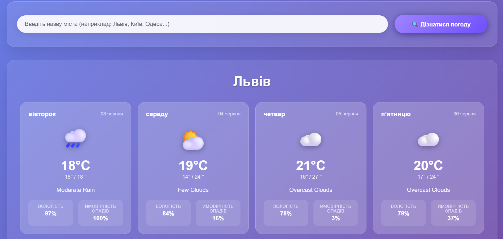

# WeatherNow — 5-денний прогноз погоди

## 📜 Опис проєкту
**WeatherNow** — це вебдодаток, що дозволяє користувачам вводити назву міста та отримувати детальний 5-денний прогноз погоди. Додаток використовує OpenWeatherMap API для отримання актуальної інформації про температуру, погодні умови, вологість, опади та інше. Система побудована на Node.js з Express, використовує EJS для динамічного рендерингу HTML та Axios для HTTP-запитів.

## ⚙️ Стек технологій

| Рівень        | Технологія                       | Призначення                                      |
|---------------|----------------------------------|--------------------------------------------------|
| 🌐 Frontend   | HTML + CSS                       | Основна розмітка та стилізація                   |
| 🎨 Шаблони    | EJS (Embedded JavaScript)        | Динамічний HTML з даними з бекенду              |
| 🔙 Backend    | Node.js + Express                | Серверна логіка та обробка маршрутів            |
| 🌍 HTTP клієнт| Axios                            | Запити до OpenWeatherMap API                    |
| 🔐 Безпека    | dotenv                           | Зберігання API-ключа у `.env` файлі             |
| ☁️ API        | OpenWeatherMap One Call API      | Отримання щоденного прогнозу погоди             |

## 🌦️ Функціональність

### Головна сторінка:
- Форма введення назви міста
- Кнопка **"Дізнатися погоду"**
- Картки із погодою на 5 днів із середніми показниками температури, вологості, ймовірності опадів, іконками та описом

#### 🌤️ Прогноз погоди
Форма для введення міста та кнопка "Дізнатися погоду":

Картки з прогнозом на 5 днів:

### Обробка запиту:
1. Користувач вводить назву міста
2. Сервер виконує запит до OpenWeatherMap Geo API для отримання координат (широта, довгота) міста
3. Потім сервер запитує OpenWeatherMap 5-day/3-hour Forecast API для отримання прогнозу з трьохгодинним інтервалом на 5 днів
4. Дані групуються по днях, обчислюються середні, мінімальні та максимальні показники

### Відповідь API включає:
- Температуру
- Опис погоди 
- Іконка погоди
- Вологість
- Ймовірність опадів

### Відображення результатів:
- Динамічна сторінка з даними на 5 днів
- Показ середньодобових температур, вологості, описів і іконок для кожного дня

### Обробка помилок:
- Якщо місто не знайдено — виводиться повідомлення про помилку
- Технічні помилки API логуються в консолі

## 🚀 Як запустити:
1. Клонуйте репозиторій
2. Встановіть залежності: `npm install`
3. Створіть `.env` файл і додайте ваш API-ключ: API_KEY=your_api_key_here
4. Запустіть сервер: `npm start`
5. Відкрийте в браузері: `http://localhost:3000`
